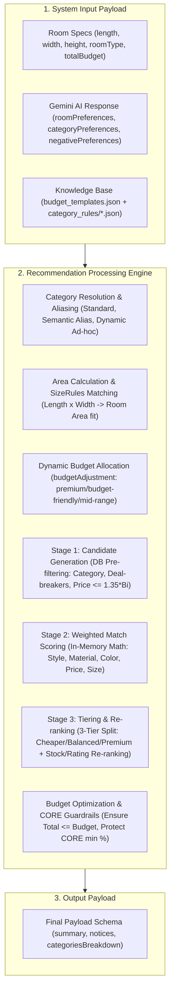

# ⚙️ Recommendation Engine Processing Specification

This document provides the full technical and architectural specification for the **Recommendation Engine Processing** step in **SmartSpaceAI**. It is 100% aligned with the actual Gemini AI response structure in [aiService.js](file:///d:/iti/SmartSpaceAi/SmartSpaceAI/back-end/src/services/aiService.js) and the knowledge base rules in [budget_templates.json](file:///d:/iti/SmartSpaceAi/SmartSpaceAI/back-end/knowledge_base/budget_templates.json) and [category_rules](file:///d:/iti/SmartSpaceAi/SmartSpaceAI/back-end/knowledge_base/category_rules).

---

## 🎯 1. Step Objective

Integrate and reconcile three core data sources:
1. **Real-world Room Specifications & Budget** (provided by user inputs).
2. **Structured AI Preferences Payload** returned by Gemini AI (`roomPreferences`, `categoryPreferences`, `negativePreferences`).
3. **Knowledge Base Rules & Budget Allocations** (`budget_templates.json` and `category_rules/<roomType>.json`).

Transform these inputs into a **categorized list of actual matched products with 3-tier alternatives (`Cheaper`, `Balanced`, `Premium`)**, handling edge cases such as unmapped categories, semantic aliasing, and fallback notices.

---

## 🔄 2. Data Flow Architecture


```mermaid
flowchart TD
    subgraph Inputs["1. System Input Payload"]
        I1["Room Specs (length, width, height, roomType, totalBudget)"]
        I2["Gemini AI Response (roomPreferences, categoryPreferences, negativePreferences)"]
        I3["Knowledge Base (budget_templates.json + category_rules/*.json)"]
    end

    subgraph Processing["2. Recommendation Processing Engine"]
        P1["Category Resolution & Aliasing (Standard, Semantic Alias, Dynamic Ad-hoc)"]
        P2["Area Calculation & SizeRules Matching (Length x Width -> Room Area fit)"]
        P3["Dynamic Budget Allocation (budgetAdjustment: premium/budget-friendly/mid-range)"]
        P4["Stage 1: Candidate Generation (DB Pre-filtering: Category, Deal-breakers, Price <= 1.35*Bi)"]
        P5["Stage 2: Weighted Match Scoring (In-Memory Math: Style, Material, Color, Price, Size)"]
        P6["Stage 3: Tiering & Re-ranking (3-Tier Split: Cheaper/Balanced/Premium + Stock/Rating Re-ranking)"]
        P7["Budget Optimization & CORE Guardrails (Ensure Total <= Budget, Protect CORE min %)"]
    end

    subgraph Outputs["3. Output Payload"]
        O1["Final Payload Schema (summary, notices, categoriesBreakdown)"]
    end

    Inputs --> Processing --> Outputs
```

---

## 📥 3. System Input Alignment

### A) Room Specs Object (`RoomSpecs`):
```json
{
  "roomType": "Living Room",
  "length_cm": 500,
  "width_cm": 400,
  "height_cm": 280,
  "area_sqm": 20,
  "totalBudget": 80000,
  "currency": "EGP"
}
```

### B) Gemini AI Extraction Object (from `aiService.js`):
```json
{
  "roomPreferences": {
    "style": "Modern Scandinavian",
    "theme": "minimalist",
    "mood": "cozy",
    "lighting": "bright natural",
    "colorPalette": ["Off-White", "Light Wood", "Sage Green"]
  },
  "categoryPreferences": [
    {
      "category": "Sofa",
      "included": true,
      "excluded": false,
      "quantity": 2,
      "preferredMaterial": "Fabric",
      "preferredColor": "Off-White",
      "preferredStyle": "Modern",
      "preferredShape": "L-shaped",
      "preferredSize": "large",
      "budgetAdjustment": "premium",
      "importance": "HIGH"
    },
    {
      "category": "Coffee Table",
      "included": true,
      "excluded": false,
      "quantity": null,
      "preferredMaterial": "Oak Wood",
      "preferredColor": null,
      "preferredStyle": "Scandinavian",
      "preferredShape": "Round",
      "preferredSize": null,
      "budgetAdjustment": "mid-range",
      "importance": "MEDIUM"
    },
    {
      "category": "Nightstand",
      "included": true,
      "excluded": false,
      "quantity": 2,
      "preferredMaterial": "Wood",
      "preferredColor": "Light Wood",
      "preferredStyle": "Scandinavian",
      "preferredShape": null,
      "preferredSize": null,
      "budgetAdjustment": "mid-range",
      "importance": "MEDIUM"
    },
    {
      "category": "Bean Bag",
      "included": true,
      "excluded": false,
      "quantity": null,
      "preferredMaterial": "Fabric",
      "preferredColor": "Sage Green",
      "preferredStyle": null,
      "preferredShape": null,
      "preferredSize": null,
      "budgetAdjustment": "budget-friendly",
      "importance": "LOW"
    }
  ],
  "negativePreferences": {
    "materialsToAvoid": ["Leather", "Glass"],
    "colorsToAvoid": ["Dark Red", "Black"],
    "categoriesToAvoid": ["Bookshelf"]
  }
}
```

> [!IMPORTANT]
> **Gemini Quantity Extraction Rules:**
> - `quantity` represents the **number of separate products/items** requested for a category (e.g. `2` for "two sofas" or "two nightstands").
> - If quantity is NOT mentioned, Gemini returns `null`. Gemini **never** uses knowledge base defaults as user intent.
> - **Product Quantity vs. Capacity/Configuration:**
>   * *"Table for 6 people"* $\rightarrow$ `Dining Table quantity: null` (1 table with seating capacity of 6), `Dining Chairs quantity: 6`.
>   * *"Double-sink vanity"* $\rightarrow$ `Vanity Unit quantity: null` (1 vanity unit with double-sink config).
>   * *"3-door wardrobe"* $\rightarrow$ `Wardrobe quantity: null` (1 wardrobe with 3 doors).

### C) Knowledge Base Rules Schema (`category_rules/*.json`):
Each room type category rule defines structured constraints:
```json
{
  "category": "Nightstand",
  "role": "CORE",
  "priority": 3,
  "defaultIncluded": true,
  "quantity": {
    "default": 2,
    "min": 1,
    "max": 2,
    "allowMultiple": true,
    "budgetMode": "PER_CATEGORY",
    "additionalItemBudgetBoost": 0,
    "sizeMode": "STANDARD"
  },
  "budget": {
    "defaultPercentage": 8,
    "minPercentage": 4,
    "maxPercentage": 12
  }
}
```
* **`quantity.default`**: Default count when user does not specify a quantity.
* **`quantity.min` / `max`**: Minimum and maximum allowable items for this category in the room.
* **`quantity.allowMultiple`**: Boolean flag indicating if multiple items can be allocated.
* **`quantity.budgetMode`**: `"PER_CATEGORY"` (allocated budget covers all items) vs `"PER_UNIT"`.
* **`quantity.sizeMode`**: `"STANDARD"` vs `"ADJUST_PER_ITEM"`.


---

## ⚙️ 4. Technical Step-by-Step Logic

### 🚨 Step 4.1: Category Resolution & Special Product Handling (Unmapped Products)

The engine takes `categoryPreferences` from Gemini and merges them with the standard categories in `budget_templates.json` for the given `roomType`:

1. **Semantic Aliasing:**
   * If a requested category (e.g., `Bean Bag` or `Console Table`) is not defined in `budget_templates.json` for that room type:
     * Check the `SEMANTIC_ALIASES` map.
     * `Bean Bag` $\rightarrow$ mapped to `Armchair`.
     * `Console Table` $\rightarrow$ mapped to `Side Table`.
     * The requested item's preferences (e.g., Sage Green, Fabric) are passed to the target standard category.
     * A system notice is logged: `"Mapped 'Bean Bag' to an appropriate Armchair for your room."`

2. **Dynamic Ad-hoc Category Creation:**
   * If the requested category is unique and cannot be semantically aliased (e.g., `Piano` or `Aquarium`):
     * Query the Products database (`Products.find({ category: /piano/i })`).
     * If products are found, create a temporary rule with `role: "OPTIONAL_ADHOC"` and default percentage (e.g., 10%).
     * Deduct budget **only from the remaining `OPTIONAL` budget or surplus, strictly preserving the minimum required percentage for `CORE` categories**.

3. **Fallback Suggestion & Notice:**
   * If no products exist in the database for the requested item (e.g., `Fireplace`):
     * Skip adding the category to prevent breaking the flow.
     * Proceed normally with the rest of the room recommendations.
     * Add a transparent user notice:
       `"We could not find 'Fireplace' in our product catalog, but we provided suitable alternatives for your room."`

---

### Step 4.1.1: Quantity Resolution & Precedence Rules

The engine resolves the target quantity ($Q_i$) for category $i$ using explicit precedence rules:

1. **Precedence Hierarchy:**
   $$\text{Resolved Quantity } (Q_i) = \begin{cases} 
   \text{userQuantity} & \text{if Gemini returned non-null integer AND } \text{rule.allowMultiple} = \text{true} \\
   \text{rule.quantity.default} & \text{if userQuantity is null} \\
   1 & \text{if } \text{rule.allowMultiple} = \text{false (forced single-unit constraint)}
   \end{cases}$$

2. **Boundary Validation:**
   * $Q_i$ is clamped between `rule.quantity.min` and `rule.quantity.max`.
   * Example 1: User requests *"2 nightstands"*. Gemini returns `quantity: 2`. Rule allows `max: 2`. Resolved $Q = 2$.
   * Example 2: User requests *"dining table for 6"*. Gemini returns `Dining Table quantity: null` (capacity vs quantity distinction). Rule `default: 1`. Resolved $Q = 1$.
   * Example 3: User requests *"two beds"* for a single bedroom. Rule specifies `allowMultiple: false, max: 1`. Resolved $Q = 1$ with system notice: *"Adjusted Bed quantity to 1 to fit standard single bedroom rules."*

---

### Step 4.2: Room Area Calculation & `sizeRules` Matching

Calculate room surface area:
$$A = \frac{\text{length\_cm} \times \text{width\_cm}}{10000} = \frac{500 \times 400}{10000} = 20 \text{ m}^2$$

Load `knowledge_base/category_rules/living_room.json`:
* For each category, match $A$ against the `sizeRules` brackets:
  * For $20 \text{ m}^2$ (bracket `min: 18, max: 25`):
    * **Sofa:** Recommended dimensions: `width: 220cm - 280cm`, `depth: 90cm - 110cm`.
    * **Coffee Table:** Recommended dimensions: `width: 110cm - 140cm`, `depth: 60cm - 75cm`.
* If `sizeMode === "ADJUST_PER_ITEM"` and $Q_i > 1$ (e.g. 2 smaller sofas instead of 1 large sofa), reduce the individual product target dimensions by $15-25\%$ so the total cumulative width fits within the room clearance.

---

### Step 4.3: Dynamic Budget Allocation & Per-Unit Pricing

For each active category:
1. **Base Allocation:**
   $$B_i^{\text{base}} = \text{TotalBudget} \times \left( \frac{\text{defaultPercentage}_i}{100} \right)$$
2. **Adjustment via Gemini `budgetAdjustment`:**
   * If `budgetAdjustment === "premium"`: Scale up towards `maxPercentage`.
   * If `budgetAdjustment === "budget-friendly"`: Scale down towards `minPercentage`.
   * If `budgetAdjustment === "mid-range"` or `null`: Use `defaultPercentage`.
3. **Multi-Unit Budget Allocation & Per-Unit Target Price ($P_{\text{unit}}$):**
   * If $Q_i > 1$:
     * Add `additionalItemBudgetBoost` if defined in the rule (e.g. $+5\%$ total budget boost for additional sofa).
     * Calculate **Per-Unit Target Budget**:
       $$P_{\text{unit}} = \frac{B_i^{\text{allocated}}}{Q_i}$$
     * Candidate matching and tier evaluation (`Cheaper`, `Balanced`, `Premium`) will target products priced around $P_{\text{unit}}$, ensuring $Q_i \times \text{Product.Price} \le B_i^{\text{allocated}}$.
4. **CORE Category Guardrails:**
   * Allocations for `CORE` items (e.g., Sofa, Bed) can never fall below their defined `minPercentage`.

---

### Step 4.4: 3-Stage Recommendation Pipeline (Candidate Generation, Scoring & Tiering)

To maximize performance when querying large product catalogs (e.g. 50,000+ items), the scoring and tiering engine operates as a **3-Stage Pipeline**:

#### 1️⃣ Stage 1: Candidate Generation (Database Pre-filtering)
Move the "Hard Exclusion" logic out of application code and push it directly into the database query. Databases are heavily indexed and optimized for fast pre-filtering.

Before the scoring engine processes items in application memory, run a database query using strict constraints:
* **Category Filter:** `WHERE category = 'Sofa'`
* **Deal-breaker Exclusion:** `AND material NOT IN (materialsToAvoid) AND color NOT IN (colorsToAvoid)`
* **Hard Budget Cap:** Since the highest tier (`Premium`) caps at $1.35 \times B_i$, immediately exclude anything above that price: `AND price <= (allocatedBudget * 1.35)`
* **Result:** Instantly reduces candidate dataset from ~50,000 products to ~500–2,000 viable candidates.

#### 2️⃣ Stage 2: Weighted Match Scoring (Application Memory)
Take the surviving candidates from Stage 1 into application memory and compute the **Weighted Match Scoring** formula:

$$\text{Score} = (W_{\text{style}} \cdot S_{\text{style}}) + (W_{\text{material}} \cdot S_{\text{material}}) + (W_{\text{color}} \cdot S_{\text{color}}) + (W_{\text{price}} \cdot S_{\text{price}}) + (W_{\text{size}} \cdot S_{\text{size}})$$

* Calculating this complex math for ~1,000 items in memory takes mere milliseconds.
* The array of scored candidates is sorted in descending order by score to isolate top matching candidates.

#### 3️⃣ Stage 3: Tiering & Re-ranking
Take the top 20–50 highest-scoring candidates from Stage 2 and classify them into **3 Budget Tiers** based on the target category budget $B_i$:
* 🟢 **`Cheaper`:** Price $< 0.85 \times B_i$.
* 🟡 **`Balanced` (Default Recommended Option):** Price between $0.85 \times B_i$ and $1.15 \times B_i$.
* 🟣 **`Premium`:** Price between $1.15 \times B_i$ and $1.35 \times B_i$.

* **Final Business Logic:** Apply secondary re-ranking (e.g., verifying real-time stock availability, boosting top user-rated items, or selecting fallback candidates).

---

## 📤 5. Output Payload Schema

```json
{
  "success": true,
  "summary": {
    "totalBudget": 80000,
    "allocatedBudget": 76200,
    "remainingBuffer": 3800,
    "currency": "EGP",
    "roomType": "Living Room",
    "roomAreaSqm": 20,
    "totalCategoriesSelected": 4
  },
  "notices": [
    {
      "type": "SEMANTIC_ALIAS_APPLIED",
      "requestedProduct": "Bean Bag",
      "mappedCategory": "Armchair",
      "message": "Mapped 'Bean Bag' to an accent Armchair matching your room style."
    },
    {
      "type": "PRODUCT_NOT_FOUND",
      "requestedProduct": "Fireplace",
      "message": "We could not find 'Fireplace' in our product catalog, but we provided suitable alternatives for your room."
    }
  ],
  "categoriesBreakdown": [
    {
      "category": "Nightstand",
      "role": "CORE",
      "priority": 3,
      "requestedQuantity": 2,
      "resolvedQuantity": 2,
      "allocatedBudget": 6400,
      "unitTargetBudget": 3200,
      "recommendedDimensions": {
        "width": { "min": 40, "max": 55 },
        "depth": { "min": 35, "max": 45 }
      },
      "recommendedProduct": {
        "id": "prod_nightstand_bal_10",
        "tier": "BALANCED",
        "title": "Nordic Light Wood Bedside Table",
        "price": 3100,
        "currency": "EGP",
        "unitPrice": 3100,
        "totalPriceForQuantity": 6200,
        "quantity": 2,
        "dimensions": { "width": 45, "depth": 40, "height": 50 },
        "material": "Wood",
        "color": "Light Wood",
        "style": "Scandinavian",
        "imageUrl": "https://cdn.smartspace.ai/products/nightstand.jpg",
        "score": 95
      },
      "tieredAlternatives": {
        "cheaper": [
          {
            "id": "prod_nightstand_cheap_01",
            "tier": "CHEAPER",
            "title": "Minimalist Pine Nightstand",
            "unitPrice": 2200,
            "totalPriceForQuantity": 4400,
            "score": 85
          }
        ],
        "balanced": [
          {
            "id": "prod_nightstand_bal_10",
            "tier": "BALANCED",
            "title": "Nordic Light Wood Bedside Table",
            "unitPrice": 3100,
            "totalPriceForQuantity": 6200,
            "score": 95
          }
        ],
        "premium": [
          {
            "id": "prod_nightstand_prem_05",
            "tier": "PREMIUM",
            "title": "Solid Oak Curved Nightstand",
            "unitPrice": 3900,
            "totalPriceForQuantity": 7800,
            "score": 91
          }
        ]
      }
    },
    {
      "category": "Armchair",
      "role": "SECONDARY",
      "priority": 5,
      "requestedQuantity": null,
      "resolvedQuantity": 1,
      "allocatedBudget": 8000,
      "unitTargetBudget": 8000,
      "mappedFrom": "Bean Bag",
      "recommendedProduct": {
        "id": "prod_armchair_02",
        "tier": "BALANCED",
        "title": "Cozy Sage Green Accent Armchair",
        "price": 7500,
        "currency": "EGP",
        "unitPrice": 7500,
        "totalPriceForQuantity": 7500,
        "quantity": 1,
        "material": "Fabric",
        "color": "Sage Green",
        "score": 92
      },
      "tieredAlternatives": {
        "cheaper": [
          {
            "id": "prod_armchair_cheap_01",
            "tier": "CHEAPER",
            "title": "Nordic Fabric Armchair",
            "unitPrice": 5500,
            "totalPriceForQuantity": 5500,
            "score": 84
          }
        ],
        "balanced": [
          {
            "id": "prod_armchair_02",
            "tier": "BALANCED",
            "title": "Cozy Sage Green Accent Armchair",
            "unitPrice": 7500,
            "totalPriceForQuantity": 7500,
            "score": 92
          }
        ],
        "premium": []
      }
    }
  ]
}
```

---

## 🛠️ 6. Backend Implementation Class (`recommendationEngine.service.js`)

Copyable, production-ready CommonJS implementation for `back-end/src/services/recommendationEngine.service.js`:

```js
const fs = require('fs').promises;
const path = require('path');
const ApiError = require('../errors/ApiError');
const HTTP_STATUS = require('../constants/statusCodes');

const SEMANTIC_ALIASES = {
  'bean bag': 'Armchair',
  'beanbag': 'Armchair',
  'console table': 'Side Table',
  'pouffe': 'Stool',
  'ottoman': 'Stool',
};

class RecommendationEngineService {

  /**
   * Main recommendation processing logic
   */
  async processRecommendations({ roomType, length_cm, width_cm, totalBudget, geminiPreferences, productsDb }) {
    const area_sqm = (length_cm * width_cm) / 10000;
    
    // 1. Load Knowledge Base Templates & Rules
    const budgetTemplate = await this.loadBudgetTemplate(roomType);
    const categoryRules = await this.loadCategoryRules(roomType);

    // 2. Resolve Unmapped Products & Semantic Aliases
    const { resolvedCategories, notices } = await this.resolveCategoriesAndAliasing(
      geminiPreferences.categoryPreferences,
      budgetTemplate.categories,
      productsDb
    );

    // 3. Allocate Budget per Category considering budgetAdjustment
    const allocatedCategories = this.allocateBudget(totalBudget, resolvedCategories, geminiPreferences.categoryPreferences);

    // 4. 3-Stage Processing Pipeline with Quantity & Per-Unit Pricing
    const categoriesBreakdown = [];
    let allocatedSum = 0;

    for (const cat of allocatedCategories) {
      const rule = categoryRules.rules.find(r => r.category.toLowerCase() === cat.category.toLowerCase()) || {};
      
      // Step 4.1.1: Resolve Quantity & Constraints
      const userPref = geminiPreferences.categoryPreferences.find(c => c.category.toLowerCase() === cat.category.toLowerCase());
      const userQuantity = userPref?.quantity || null;
      const resolvedQuantity = this.resolveQuantity(userQuantity, rule);
      
      // Calculate per-unit budget
      const unitTargetBudget = cat.allocatedBudget / resolvedQuantity;

      // Match size rules based on room area
      const matchedSizeRule = this.matchSizeRule(rule.sizeRules, area_sqm);

      // Stage 1: Candidate Generation (Targeting unit price <= 1.35 * unitTargetBudget)
      const candidateProducts = await this.fetchAndFilterProducts(cat, geminiPreferences, productsDb, matchedSizeRule, unitTargetBudget);

      // Stage 2: Weighted Match Scoring
      const scoredProducts = this.scoreProducts(candidateProducts, cat, geminiPreferences.roomPreferences);

      // Stage 3: Tiering & Re-ranking based on unitTargetBudget
      const tiered = this.classifyTiers(scoredProducts, unitTargetBudget, resolvedQuantity);

      const recommendedProduct = tiered.balanced[0] || tiered.cheaper[0] || tiered.premium[0] || null;
      if (recommendedProduct) {
        allocatedSum += (recommendedProduct.unitPrice * resolvedQuantity);
      }

      categoriesBreakdown.push({
        category: cat.category,
        role: cat.role,
        priority: cat.priority,
        requestedQuantity: userQuantity,
        resolvedQuantity,
        allocatedBudget: cat.allocatedBudget,
        unitTargetBudget,
        mappedFrom: cat.mappedFrom || null,
        recommendedDimensions: matchedSizeRule?.recommendedDimensions || null,
        recommendedProduct,
        tieredAlternatives: tiered
      });
    }

    return {
      success: true,
      summary: {
        totalBudget,
        allocatedBudget: allocatedSum,
        remainingBuffer: totalBudget - allocatedSum,
        currency: 'EGP',
        roomType,
        roomAreaSqm: area_sqm,
        totalCategoriesSelected: categoriesBreakdown.length
      },
      notices,
      categoriesBreakdown
    };
  }

  resolveQuantity(userQuantity, rule = {}) {
    const qRule = rule.quantity || {};
    if (qRule.allowMultiple === false) return 1;
    if (Number.isInteger(userQuantity) && userQuantity >= 1) {
      const min = qRule.min || 1;
      const max = qRule.max || 10;
      return Math.min(Math.max(userQuantity, min), max);
    }
    return qRule.default || 1;
  }

  async loadBudgetTemplate(roomType) {
    const filePath = path.join(__dirname, '../../knowledge_base/budget_templates.json');
    const data = JSON.parse(await fs.readFile(filePath, 'utf8'));
    const template = data.templates.find(t => t.roomType.toLowerCase() === roomType.toLowerCase());
    if (!template) throw new ApiError(HTTP_STATUS.NOT_FOUND, `No budget template found for room type: ${roomType}`);
    return template;
  }

  async loadCategoryRules(roomType) {
    const fileName = `${roomType.toLowerCase().replace(/\s+/g, '_')}.json`;
    const filePath = path.join(__dirname, '../../knowledge_base/category_rules', fileName);
    return JSON.parse(await fs.readFile(filePath, 'utf8'));
  }

  matchSizeRule(sizeRules = [], area_sqm) {
    return sizeRules.find(sr => area_sqm >= sr.roomArea.min && area_sqm <= sr.roomArea.max) || sizeRules[0] || null;
  }

  classifyTiers(products, unitTargetBudget, resolvedQuantity = 1) {
    const cheaper = [];
    const balanced = [];
    const premium = [];

    products.forEach(p => {
      const ratio = p.price / unitTargetBudget;
      const formattedProduct = {
        ...p,
        unitPrice: p.price,
        totalPriceForQuantity: p.price * resolvedQuantity,
        quantity: resolvedQuantity
      };
      if (ratio < 0.85) cheaper.push({ ...formattedProduct, tier: 'CHEAPER' });
      else if (ratio <= 1.15) balanced.push({ ...formattedProduct, tier: 'BALANCED' });
      else premium.push({ ...formattedProduct, tier: 'PREMIUM' });
    });

    return {
      cheaper: cheaper.sort((a,b) => b.score - a.score).slice(0, 3),
      balanced: balanced.sort((a,b) => b.score - a.score).slice(0, 3),
      premium: premium.sort((a,b) => b.score - a.score).slice(0, 3)
    };
  }
}

module.exports = new RecommendationEngineService();
```

---

## 🎯 Summary

This document is 100% aligned with:
1. `aiService.js` (`roomPreferences`, `categoryPreferences`, `negativePreferences`, and `quantity` extraction).
2. `budget_templates.json` and `category_rules/*.json` (including `quantity` schema rules: `min`, `max`, `allowMultiple`, `budgetMode`, `sizeMode`).
3. Special product strategies (Semantic Aliasing, Dynamic Ad-hoc Category, Fallback Notices).
4. Quantity Resolution Precedence (Explicit Gemini quantity > KB Default > Single-unit constraints).
5. Multi-unit budget allocation ($P_{\text{unit}} = B_i / Q_i$) and 3-tier product alternatives (`Cheaper`, `Balanced`, `Premium`).

