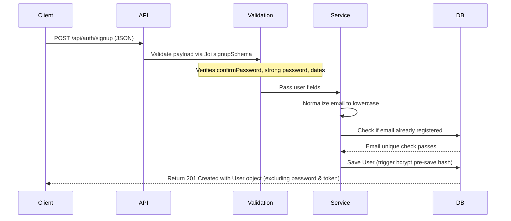
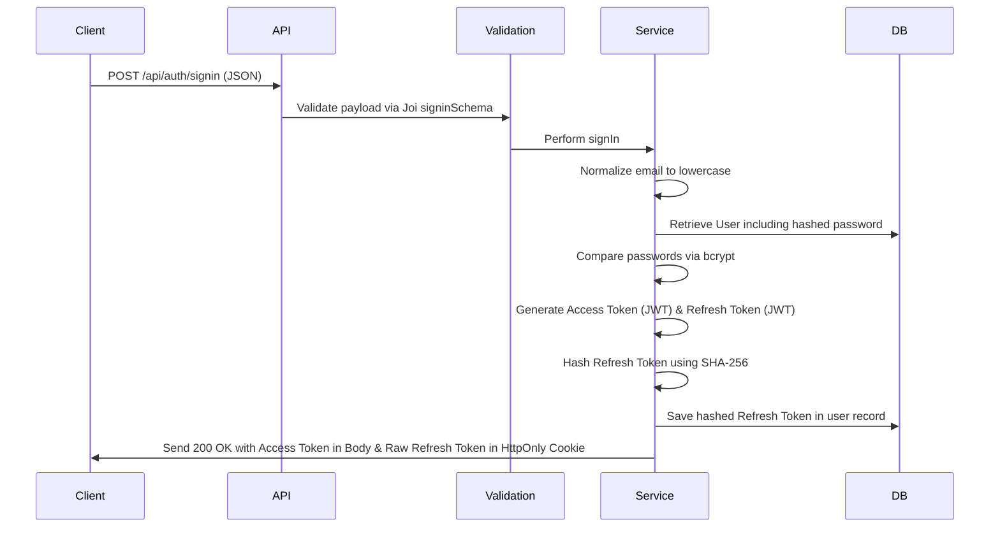

# REST API Project Documentation

This documentation provides a comprehensive guide to the clean architecture, package configurations, security details, and API workflows implemented in this production-ready Node.js + Express REST API.

---

## 1. Folder Structure Explanation

The application follows a modular and scalable structure inside the `src/` directory. This keeps responsibilities strictly isolated:

```text
src/
├── constants/           # Global immutable constants (HTTP status codes, standard messages)
├── controllers/         # Handles HTTP requests/responses; delegates business logic to services
├── database/            # Database initialization and connection logic
├── errors/              # Custom error classes (ApiError) and global error parsing
├── helpers/             # Specialized helpers (e.g., JWT signing/verification)
├── middlewares/         # Express middlewares (auth protection, file upload, limiters, logging)
├── models/              # Mongoose schemas and database models
├── routes/              # Express routing definitions mapping endpoints to controllers
├── services/            # Core business logic; independent of request/response context
├── utils/               # Generic utility functions (async error wrappers, response helpers)
├── validators/          # Joi schemas defining strict validation constraints
├── app.js               # Express application configuration and middleware registration
└── server.js            # Node.js server bootstrapper and uncaught exception handler
```

---

## 2. Package Usage and Security Configurations

Each package has been selected and configured to fulfill security and performance requirements:

*   **`express`**: The core web framework used to configure routing and middleware.
*   **`mongoose`**: MongoDB object modeling tool. It enforces schema structures, validation, indices, and handles database connections.
*   **`jsonwebtoken`**: Generates and verifies Access Tokens (passed in headers) and Refresh Tokens (passed via cookies).
*   **`bcrypt`**: A password hashing library. Used to hash passwords using salted rounds (10 rounds) before persistence, and to compare incoming passwords.
*   **`multer`**: Multipart/form-data parser. Used to handle profile image uploads, verifying file types (images only) and size limits (5MB max).
*   **`joi`**: A schema description language and data validator. Used to validate incoming request bodies (sign-up, sign-in, profile-update) before they reach the controllers.
*   **`helmet`**: A security middleware that sets various HTTP response headers (such as `X-Content-Type-Options`, `Content-Security-Policy`) to protect against common vulnerabilities.
*   **`hpp`**: Protects against HTTP Parameter Pollution attacks by ensuring query/body parameters are not duplicated to execute unexpected behaviors.
*   **`express-xss-sanitizer`**: Sanitizes user input in request bodies, query strings, and parameters to neutralize cross-site scripting (XSS) attacks.
*   **`express-rate-limit`**: Limits repeated requests to endpoints (100 requests per 15 minutes per IP) to prevent denial-of-service (DoS) or brute-force attempts.
*   **`cors`**: Enables Cross-Origin Resource Sharing. Configured with a defined `CLIENT_URL` and `credentials: true` to securely allow credential-bearing cookie exchanges.
*   **`compression`**: Compresses response bodies using GZIP, decreasing transfer size and latency.
*   **`cookie-parser`**: Parses Cookie headers and populates `req.cookies`, which allows reading the HttpOnly Refresh Token.
*   **`dotenv`**: Loads environment variables from the `.env` file into `process.env`.

---

## 3. Middleware Architecture

Our Express app uses six key middlewares to process requests safely:

1.  **Auth Middleware (`auth.middleware.js`)**:
    *   *Why it exists*: Protects endpoints by extracting the JWT Access Token from the `Authorization: Bearer <token>` header, verifying its signature, fetching the associated user, and attaching the user object to `req.user`.
2.  **Error Middleware (`error.middleware.js`)**:
    *   *Why it exists*: Intercepts throw statements or `next(err)` calls globally. It translates Mongo database errors, validation failures, and JWT token expirations into standard JSON error responses.
3.  **Not Found Middleware (`notFound.middleware.js`)**:
    *   *Why it exists*: Catches any incoming request that does not match any registered routes, raising a custom `404 Not Found` API Error.
4.  **Validation Middleware (`validation.middleware.js`)**:
    *   *Why it exists*: Validates incoming payloads against Joi schemas. Rejects requests early with a detailed, formatted error structure if they contain invalid, missing, or forbidden fields.
5.  **Upload Middleware (`upload.middleware.js`)**:
    *   *Why it exists*: Configures Multer to store uploaded images in the `/uploads` directory, assigning unique filenames to prevent overlaps, and checking sizes and image mime-types.
6.  **Rate Limiter Middleware (`rateLimiter.middleware.js`)**:
    *   *Why it exists*: Prevents system abuse by capping the request volume an IP address can make in a specified window of time.

---

## 4. Authentication Flow

### A. Sign Up


### B. Sign In


### C. Logout
*   Requires the request to be authenticated via the Access Token (`protect` middleware).
*   The API fetches the authenticated user's ID.
*   The `authService` clears the saved `refreshToken` from the user's document in MongoDB.
*   The controller clears the client's `refreshToken` cookie by issuing a `clearCookie` command.
*   Returns a `200 OK` success response.

---

## 5. Refresh Token Flow

Refresh tokens provide a safe way to keep users logged in without exposing long-lived access credentials in client-side storage:

1.  **Issue**: During a successful Sign In, a short-lived Access Token (expires in 15 minutes) is sent in the response body. A long-lived Refresh Token (expires in 7 days) is set as an `HttpOnly`, `Secure` (in production), and `SameSite=Strict` cookie.
2.  **Request**: When the Access Token expires, the client calls `POST /api/auth/refresh`. The browser automatically transmits the HttpOnly cookie.
3.  **Verification**: 
    *   The backend extracts the cookie and validates the Refresh Token's signature.
    *   The database record is fetched and the token is hashed using SHA-256.
    *   The stored hash and the incoming hash are compared using a constant-time check (`crypto.timingSafeEqual`) to prevent timing attacks.
4.  **Rotation (Token Rotation)**:
    *   To prevent replay attacks, a new Access Token *and* a new Refresh Token are generated.
    *   The database is updated with the SHA-256 hash of the new Refresh Token.
    *   The new raw Refresh Token is returned inside a fresh HttpOnly cookie.
    *   The new Access Token is returned in the response body.

---

## 6. Request Lifecycle

The lifecycle of an incoming request follows this path:

1.  **Server Listener**: The port gets hit. `server.js` triggers `app.js` only after MongoDB connects successfully.
2.  **Global Middlewares**:
    *   `helmet` configures headers.
    *   `cors` checks origins.
    *   `express.json()` and `express.urlencoded()` parse request bodies.
    *   `cookieParser` parses cookies.
    *   `xss()` sanitizes request inputs.
    *   `hpp()` cleans query parameters.
    *   `compression()` preps response compression.
3.  **Router Routing**: The route matches `/api/auth` or `/api/users`.
4.  **Endpoint Middlewares**:
    *   `protect` checks the Authorization header for valid JWT.
    *   `uploadProfileImage` parses any file fields (runs before validators so Joi can check text inputs).
    *   `validate(schema)` runs schema validation against Joi.
5.  **Controller Action**: Handled by `asyncHandler`. Calls corresponding service methods.
6.  **Service Business Layer**: Runs queries, invokes Mongoose hooks, updates user documents.
7.  **Database Layer**: MongoDB stores or updates records.
8.  **Response Delivery**: Controller invokes `sendSuccess` helper to form the success JSON payload, returning the correct HTTP code.
9.  **Error Propagation**: If any step fails, the error is thrown, caught by `asyncHandler`, and piped to `globalErrorHandler` to structure the error JSON.

---

## 7. Postman Collection Integration

We have provided a fully configured Postman collection to easily import and test the endpoints:

*   **Location**: `doc/postman_collection.json`
*   **Variable Scope**:
    *   `base_url`: Defaults to `http://localhost:3000/api`
    *   `accessToken`: Managed dynamically by collection scripts.
*   **Automated Authentication**:
    *   The **Sign In** and **Refresh Token** requests contain a post-execution Test script that reads the response payload and automatically saves the updated `accessToken` to the collection variables.
    *   All protected endpoints (under the `Users` folder and the **Logout** request) are configured to use a Bearer token referencing `{{accessToken}}` automatically.
    *   Cookies are stored by Postman natively. Thus, when `POST /auth/signin` is run, the long-lived refresh token cookie is set and automatically sent along with any `POST /auth/refresh` commands.
