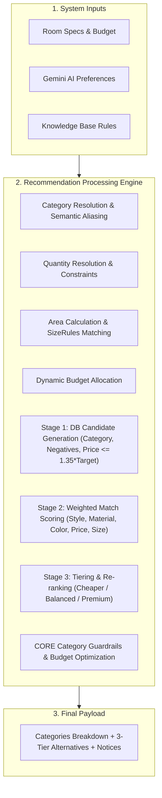

# 🏙️ SmartSpaceAI - Complete Project Reference Documentation

> **Note for AI Assistant:** This file serves as the comprehensive, authoritative context document for the entire SmartSpaceAI codebase. Whenever the user requests changes, new features, bug fixes, or architectural updates, consult this document and **update `project.md` accordingly** after completing the changes.

---

## 📋 1. Project Overview & System Architecture

**SmartSpaceAI** is a full-stack, AI-driven interior design and furniture recommendation platform. The platform enables users to manage apartments and rooms, upload room layout photos, extract intelligent design preferences via **Google Gemini AI**, run an advanced 3-stage recommendation algorithm against real-world e-commerce product catalogs (IKEA, Homzmart, Amazon, Jumia, Noon, etc.), and generate visual room staging designs. It also includes credit-based billing (via Stripe integration), multi-language support (English & Arabic with RTL layout support), and web scraping engines.

### 🛠️ Core Technology Stack

#### Backend (`/back-end`)
- **Runtime & Framework**: Node.js (CommonJS), Express 5 (`express^5.2.1`)
- **Database & ORM**: MongoDB, Mongoose 9 (`mongoose^9.7.4`)
- **AI Engine**: Google Gen AI SDK (`@google/genai^2.12.0`)
- **Authentication**: Dual-token JWT (Access Token in `Authorization` header, Refresh Token in `HttpOnly` Cookie), Bcrypt hashing (`bcrypt^6.0.0`)
- **Security & Middleware**: Helmet (`helmet^8.2.0`), HPP (`hpp^0.2.3`), Express XSS Sanitizer (`express-xss-sanitizer^2.0.2`), Express Rate Limit (`express-rate-limit^8.5.2`), CORS (`cors^2.8.6`), Cookie Parser (`cookie-parser^1.4.7`), Compression (`compression^1.8.1`)
- **Validation**: Joi (`joi^18.2.3`)
- **Media & File Processing**: Multer (`multer^2.2.0`), Sharp (`sharp^0.35.3`)
- **Web Scraping**: Cheerio (`cheerio^1.2.0`)
- **Payment Processing**: Stripe Node SDK (`stripe^22.3.1`)
- **Localization**: i18next (`i18next^26.3.6`) & HTTP Middleware (`i18next-http-middleware^3.9.7`)
- **Caching**: NodeCache (`node-cache^5.1.2`)
- **Testing**: Jest (`jest^30.4.2`)

#### Frontend (`/front-end`)
- **Framework & Build**: React 19 (`react^19.2.7`), Vite (`vite^8.1.4`)
- **Routing**: React Router v7 (`react-router-dom^7.18.1`)
- **Styling**: TailwindCSS 3 (`tailwindcss^3.4.19`), PostCSS, Autoprefixer, Custom CSS Variables
- **Icons**: Lucide React (`lucide-react^1.24.0`)
- **HTTP Client**: Axios (`axios^1.18.1`) with dynamic refresh-token interceptor
- **Localization**: `i18next`, `react-i18next`, `i18next-browser-languagedetector`
- **Linter**: Oxlint (`oxlint^1.71.0`)

---

## 📂 2. Repository & File Structure

```text
SmartSpaceAI/
├── project.md                            # Complete Project Architecture & Context (This File)
├── back-end/                             # Node.js + Express REST API Backend
│   ├── app.js                            # Express app setup, security middlewares, route mounting
│   ├── package.json                      # Backend dependencies & run scripts
│   ├── doc/                              # Detailed module specs & Postman exports
│   │   ├── codebase_documentation.md     # Architecture & security guide
│   │   ├── RECOMMENDATION_ENGINE_SPEC.md # Spec for 3-stage recommendation processing
│   │   ├── ENHANCE_ROOM_FEATURE_SPEC.md  # Spec for ENHANCE_ROOM pipeline & NLU actions
│   │   ├── rooms_and_generations_documentation.md # Spec for Rooms & Generations endpoints
│   │   └── postman_collection.json       # Exported Postman tests & environment
│   ├── knowledge_base/                   # Rules & templates for recommendation engine
│   │   ├── budget_templates.json         # Per-room category budget percentages
│   │   ├── category_rules/               # Room-specific rules (living_room.json, bedroom.json, etc.)
│   │   └── furniture/                    # Categorized furniture reference JSONs
│   ├── scripts/                          # Seeding & database utility scripts
│   │   ├── seedProducts.js               # Product catalog seeder
│   │   ├── generate_expanded_dataset.py  # Synthetic dataset generator
│   │   └── fixAllIkeaImageUrls.js        # Image URL patch script
│   ├── scratch/                          # Testing & diagnostic scripts
│   └── src/                              # Source code directory
│       ├── server.js                     # Server entrypoint & DB connection wrapper
│       ├── config/                       # Configuration parameters (recommendation.config.js)
│       ├── constants/                    # Standard HTTP status codes & constants
│       ├── database/                     # MongoDB connection pool initialization (`db.js`)
│       ├── errors/                       # Custom `ApiError` class & centralized error handler
│       ├── helpers/                      # Token generation & verification helpers
│       ├── locales/                      # Localization JSONs (`en.json`, `ar.json`)
│       ├── middlewares/                  # Auth, Validation, Upload, RateLimit, i18n, 404, Error
│       ├── models/                       # Mongoose Schemas (User, Apartment, Room, Layout, Generation, Product, Payment, Contact)
│       ├── routes/                       # Express Router endpoints mapping
│       ├── services/                     # Business logic & AI/Scraping/Recommendation services
│       │   ├── aiService.js              # Gemini AI intent extraction & image generation
│       │   ├── promptBuilder.service.js  # Modular system prompt builder for AI models
│       │   ├── recommendation/           # Modular 3-stage Recommendation Processing Engine
│       │   │   ├── recommendationEngine.js
│       │   │   ├── categoryResolver.js
│       │   │   ├── budgetAllocator.js
│       │   │   ├── candidateGenerator.js
│       │   │   ├── productScorer.js
│       │   │   ├── tierClassifier.js
│       │   │   ├── budgetOptimizer.js
│       │   │   └── helpers.js
│       │   └── scraping/                 # E-commerce Web Scraper Engine (IKEA, Homzmart, Amazon, Jumia, Noon, etc.)
│       ├── utils/                        # Async wrapper (`asyncHandler`) & standard response formatters
│       └── validators/                   # Joi schema validators for API endpoints
└── front-end/                            # Vite + React Single Page Application
    ├── index.html                        # HTML entry point
    ├── vite.config.js                    # Vite bundler configuration
    ├── tailwind.config.js                # Tailwind CSS configuration
    ├── package.json                      # Frontend dependencies & scripts
    ├── landing page/                     # Static HTML landing page assets
    └── src/                              # React application source
        ├── main.jsx                      # App root renderer
        ├── App.jsx                       # Main router provider container
        ├── index.css                     # Global design tokens & CSS rules
        ├── i18n.js                       # Internationalization setup (EN/AR)
        ├── api/                          # Axios API clients (AuthApi, ApartmentApi, RoomApi, GenerationApi, BillingApi, etc.)
        ├── Components/                   # Reusable UI components & modals
        │   ├── ApartmentCard.jsx
        │   ├── RoomCard.jsx
        │   ├── CreateApartmentModal.jsx
        │   ├── CreateRoomModal.jsx
        │   ├── Icon.jsx
        │   ├── ProtectedRoute.jsx
        │   ├── StudioHeader.jsx / StudioFooter.jsx
        │   └── RoomGeneration/           # Stepper flow & modal components
        │       ├── Stepper.jsx
        │       ├── StepSelectType.jsx
        │       ├── StepRoomDetails.jsx
        │       ├── StepDesignInstructions.jsx
        │       ├── StepSelectProducts.jsx
        │       ├── StepRoomGenerationResult.jsx
        │       ├── ProductDetailModal.jsx
        │       ├── BudgetWarningModal.jsx
        │       └── ValidationOverlay.jsx
        ├── context/                      # Global React Contexts (`AuthContext.jsx`)
        ├── Layouts/                      # Page layout wrappers (`AuthLayout.jsx`, `DashboardLayout.jsx`, `SellerLayout.jsx`)
        ├── locales/                      # Locale dictionaries (`en.js`, `ar.js`)
        ├── Pages/                        # Application screens
        │   ├── Auth/                     # Login & Register
        │   ├── Dashboard/                # Dashboard, ApartmentRooms, RoomDetail, MyRooms, RoomGeneration, Credits, Profile, PaymentSuccess
        │   ├── LandingPage/              # Interactive landing page
        │   ├── ContactUs/                # Support contact screen
        │   ├── Seller/                   # Seller portal screens (SellerDashboard, SellerProducts, SellerProductForm, SellerOrders, SellerEarnings)
        │   └── NotFound.jsx              # 404 page
        ├── Routers/                      # React Router configuration (`AppRouter.jsx`)
        └── utils/                        # Frontend helpers (`productUtils.js`)
```

---

## ⚡ 3. Backend Architecture & Core Domains

### A. Database Models & Schema Specifications

1. **User Model (`user.model.js`)**:
   - `profile`: `firstName`, `lastName`, `avatar`, `dateOfBirth`
   - `authentication`: `email` (unique, lowercase), `passwordHash` (bcrypt), `provider` (`'local'`, `'google'`, `'apple'`), `providerId`, `emailVerified`, `lastLogin`, `refreshToken` (SHA-256 hashed)
   - `preferences`: `theme`, `language`, `timezone`
   - `billing`: `credits` (default 50), `stripeCustomerId`

2. **Apartment Model (`apartment.model.js`)**:
   - `ownerId`: ObjectId ref `User`
   - `name`: String, required
   - `description`: String
   - `coverImage`: `url`, `storageProvider`, `fileName`, `uploadedAt`
   - `location`: `country`, `city`, `district`, `street`, `building`, `floor`, `apartmentNumber`
   - `status`: `['ACTIVE', 'ARCHIVED']`

3. **Room Model (`room.model.js`)**:
   - `apartmentId`: ObjectId ref `Apartment`
   - `name`: String
   - `roomType`: String (e.g. `'LIVING_ROOM'`, `'BEDROOM'`, `'KITCHEN'`, `'BATHROOM'`, `'OFFICE'`, etc.)
   - `dimensions`: `width`, `length`, `height`, `unit` (`'cm'`, `'m'`)
   - `sourceImages`: Array of `{ url, storageProvider, fileName, uploadedAt }`
   - `coverImageId`: ObjectId ref `sourceImages`
   - `selectedGenerationId`: ObjectId ref `Generation`
   - `status`: `['ACTIVE', 'ARCHIVED']`

4. **RoomLayout Model (`roomLayout.model.js`)**:
   - `roomId`: ObjectId ref `Room`
   - `layoutImage`: `url`, `storageProvider`, `fileName`
   - `detectedObjects`: Array of bounding boxes and object tags extracted from room photos.

5. **Generation Model (`generation.model.js`)**:
   - `roomId`: ObjectId ref `Room`
   - `ownerId`: ObjectId ref `User`
   - `styleId`: ObjectId reference/string
   - `generationType`: `['CREATE_FROM_SCRATCH', 'ENHANCE_EXISTING']`
   - `status`: `['PENDING', 'PROCESSING', 'COMPLETED', 'FAILED', 'CANCELLED']`
   - `prompt`: Detailed design prompt
   - `negativePrompt`: Excluded design elements
   - `creditsUsed`: Number of credits deducted
   - `settings`: `creativity`, `preserveLayout`, `colorPalette`, `lighting`, `quality`, `aspectRatio`, `seed`
   - `images`: Array of `{ url, thumbnail, width, height, selected }`
   - `ai`: `provider`, `model`, `version`, `generationTime`

6. **Product Model (`product.model.js`)**:
   - `title`: String
   - `category`: String (e.g. `'Sofa'`, `'Coffee Table'`, `'Bed'`, `'Nightstand'`)
   - `brand` / `vendor`: String
   - `price`: Number, `currency`: String (default `'EGP'`)
   - `dimensions`: `{ width, depth, height, unit }`
   - `material`: String (e.g. `'Fabric'`, `'Wood'`, `'Glass'`, `'Leather'`)
   - `color`: String
   - `style`: String (e.g. `'Modern'`, `'Scandinavian'`, `'Classic'`)
   - `shape`: String
   - `inStock`: Boolean, `rating`: Number
   - `store`: String (e.g. `'IKEA'`, `'Homzmart'`, `'Amazon'`, `'Jumia'`)
   - `productUrl`: String, `imageUrl`: String

7. **PaymentHistory Model (`paymentHistory.model.js`)**:
   - `userId`: ObjectId ref `User`
   - `stripeSessionId`: String
   - `amount`: Number, `currency`: String
   - `creditsAdded`: Number
   - `status`: `['PENDING', 'COMPLETED', 'FAILED']`

8. **Contact Model (`contact.model.js`)**:
   - `name`, `email`, `subject`, `message`, `status` (`'NEW'`, `'RESOLVED'`)

---

### B. Security & Authentication Architecture

- **Token Lifecycle**:
  - `Access Token`: Expiration 15 minutes, returned in response payload, attached in header `Authorization: Bearer <token>`.
  - `Refresh Token`: Expiration 7 days, set as `HttpOnly`, `SameSite=Strict` cookie. Stored in DB after being SHA-256 hashed.
  - **Token Rotation**: Every call to `/api/auth/refresh` invalidates the old refresh token and issues a new pair of Access & Refresh tokens.
- **Middleware Guardrails**:
  - `helmet`: Sets secure HTTP response headers (`X-Content-Type-Options`, `Content-Security-Policy`).
  - `express-rate-limit`: Restricts brute-force hits (100 requests per 15 minutes per IP).
  - `express-xss-sanitizer` & `hpp`: Cleans request bodies/parameters against XSS and parameter pollution.
  - `validation.middleware.js`: Intercepts bad payloads using Joi schemas before reaching business controllers.

---

### C. Recommendation Processing Engine (`src/services/recommendation/`)

The recommendation engine executes a 3-Stage Pipeline to balance speed, user intent accuracy, and budget constraints:



1. **Category Resolution (`categoryResolver.js`)**: Matches user category intent against `budget_templates.json`. Resolves non-standard names using `SEMANTIC_ALIASES` (e.g. *"bean bag"* $\rightarrow$ *"Armchair"*), handles dynamic ad-hoc categories, or logs non-fatal notices when products are unavailable.
2. **Quantity Resolution (`helpers.js`)**: Enforces precedence (Explicit Gemini requested count > Knowledge Base default > Max/Min boundaries).
3. **Area & `sizeRules` Matching (`helpers.js`)**: Calculates room area ($A = \frac{\text{Length} \times \text{Width}}{10000} \text{ m}^2$) and maps standard dimension constraints per room type.
4. **Dynamic Budget Allocation (`budgetAllocator.js`)**: Determines target budget per category ($B_i$) and per unit target price ($P_{\text{unit}} = B_i / Q_i$). Protects `CORE` item budget percentages.
5. **3-Stage Pipeline**:
   - **Stage 1 (Candidate Generation - DB Level)**: `candidateGenerator.js` queries Mongo DB with hard pre-filters (`category`, excluding `materialsToAvoid` / `colorsToAvoid`, capping unit price at $1.35 \times P_{\text{unit}}$).
   - **Stage 2 (Weighted Match Scoring - Memory)**: `productScorer.js` scores surviving candidates using normalized weights:
     $$\text{Score} = (W_{\text{style}} \cdot S_{\text{style}}) + (W_{\text{material}} \cdot S_{\text{material}}) + (W_{\text{color}} \cdot S_{\text{color}}) + (W_{\text{price}} \cdot S_{\text{price}}) + (W_{\text{size}} \cdot S_{\text{size}})$$
   - **Stage 3 (Tiering & Re-ranking)**: `tierClassifier.js` splits top products into 3 budget tiers:
     - 🟢 **`Cheaper`**: Unit Price $< 0.85 \times P_{\text{unit}}$
     - 🟡 **`Balanced`**: $0.85 \le \text{Unit Price} / P_{\text{unit}} \le 1.15$
     - 🟣 **`Premium`**: $1.15 < \text{Unit Price} / P_{\text{unit}} \le 1.35$

---

### D. AI Room Generation & Prompt Pipeline

- **Google Gemini Integration (`aiService.js`)**: Uses `@google/genai` (Gemini 2.5 Flash Vision) to validate uploaded room photos (`validateRoomImage`) and extract structured design preferences (`extractPreferences`).
- **Vision Guardrail**: Evaluates room images for structural composition (corner shot), lighting quality, and empty space requirements before permitting AI generation.
- **Structured Preference Extraction**: Parses raw user prompts into structured JSON (`roomPreferences`, `categoryPreferences`, `negativePreferences`). For `ENHANCE_ROOM` mode, extracts per-category `action` (`REPLACE`, `ADD`, `KEEP`, `REMOVE`).
- **Pixel-Cloning & Visual Fidelity**: `promptBuilder.service.js` enforces strict pixel-cloning directives to lock room dimensions and eliminate AI hallucinations.
- **Multimodal Composite Rendering Engine**: Supports both `CREATE_FROM_SCRATCH` (empty space staging) and `ENHANCE_ROOM` (inpainting & restyling of existing furnished layouts). Transforms room and product reference photos into Base64 Data URIs and calls Qwen Multimodal API for exact RGB/geometric cloning, with fallback mechanisms.
- **Product Rendering Cache**: Implements caching for identical generation requests to save API tokens and compute power.

---

### E. E-Commerce Web Scraping Framework (`src/services/scraping/`)

- **Scraper Engine (`scraperService.js`)**: Scrapes real furniture platforms using platform-specific adapters (`shopifyScraper.js`, `woocommerceScraper.js`, `ikeaScraper.js`, `amazonScraper.js`, `noonScraper.js`, `jumiaScraper.js`, `homzmartScraper.js`).
- **Product Normalizer (`productMapper.js`)**: Transforms raw HTML/JSON data into standard `Product` database schemas.

---

## 🎨 4. Frontend Architecture & UI Workflow

### A. Core Routes & Navigation (`AppRouter.jsx`)
- **Public Routes**: `/` (Landing Page), `/contact` (Support Page)
- **Auth Routes (`AuthLayout`)**: `/login`, `/register`
- **Protected Routes (`DashboardLayout` guarded by `ProtectedRoute`)**:
  - `/home` & `/apartments` (Dashboard / Apartment list)
  - `/apartments/:apartmentId` (Apartment rooms view)
  - `/apartments/:apartmentId/rooms/:roomId` (Room detail view)
  - `/rooms` (All user rooms view)
  - `/room-generation` (Interactive Room Generation Stepper)
  - `/credits` & `/billing` (Credits & Stripe Checkout)
  - `/profile` (User settings)
  - `/payment-success` (Post-stripe payment confirmation)
- **Protected Seller Routes (`SellerLayout` guarded by `ProtectedRoute`)**:
  - `/seller` & `/seller/dashboard` (Seller KPI overview, recent orders, AI validation feed)
  - `/seller/products` (Catalog of products with search and AI validation filters)
  - `/seller/products/create` (Add a product listing through a multi-step form wizard)
  - `/seller/products/:id/edit` (Update details of an existing product)
  - `/seller/orders` (Track customer buy requests and transition status)
  - `/seller/earnings` (View total earnings, commission deductions, monthly ledger)

---

### B. Interactive Room Generation Stepper Workflow (`RoomGeneration.jsx`)

The creation workflow consists of 5 modular steps:
1. **Step 1: Select Type (`StepSelectType.jsx`)**: Choose between scratch design (`CREATE_FROM_SCRATCH`) or room enhancement (`ENHANCE_EXISTING`).
2. **Step 2: Room Details (`StepRoomDetails.jsx`)**: Input room type, length/width/height dimensions, and budget.
3. **Step 3: Design Instructions (`StepDesignInstructions.jsx`)**: Specify style (Modern, Scandinavian, Industrial, etc.), color palette, and text prompt.
4. **Step 4: Select Products (`StepSelectProducts.jsx`)**: Review candidate furniture recommended by the 3-Stage Engine. Toggle between `Cheaper`, `Balanced`, and `Premium` options for each category.
5. **Step 5: Generation Result (`StepRoomGenerationResult.jsx`)**: View rendered AI designs, download generated staged room layouts, or save design presets.

---

### C. Frontend API Layer & Axios Interceptors (`front-end/src/api/`)

- `axios.js`: Configured with `baseURL = VITE_API_BASE_URL` and `withCredentials: true`.
- **Request Interceptor**: Automatically injects `Authorization: Bearer <accessToken>` header from `AuthContext`.
- **Response Interceptor**: On `401 Unauthorized`, automatically sends a call to `AuthApi.refreshToken()`, receives a new token, updates `AuthContext`, and replays the original failed request seamlessly.

---

## 📡 5. REST API Endpoints Quick Reference

### Authentication (`/api/auth`)
- `POST /api/auth/signup` - Register a new account
- `POST /api/auth/signin` - Authenticate user & issue tokens
- `POST /api/auth/logout` - Clear refresh token cookie & session
- `POST /api/auth/refresh` - Rotate access & refresh tokens

### User Management (`/api/users`)
- `GET /api/users/profile` - Fetch current user profile
- `PATCH /api/users/profile` - Update profile & avatar image upload
- `PATCH /api/users/change-password` - Change account password

### Apartments (`/api/apartments`)
- `GET /api/apartments` - List user apartments (supports search, status filter, pagination)
- `GET /api/apartments/:id` - Get apartment details
- `POST /api/apartments` - Create apartment (with cover image upload)
- `PATCH /api/apartments/:id` - Update apartment details
- `DELETE /api/apartments/:id` - Delete apartment

### Rooms (`/api/rooms`)
- `GET /api/rooms` - List rooms (supports filtering by `apartmentId`, `roomType`, pagination)
- `GET /api/rooms/:id` - Get single room details
- `POST /api/rooms` - Add room to an apartment
- `PATCH /api/rooms/:id` - Update room dimensions, cover image, or selected design
- `DELETE /api/rooms/:id` - Delete room and associated local images

### Room Layouts (`/api/room-layouts`)
- `GET /api/room-layouts/:roomId` - Fetch room layouts
- `POST /api/room-layouts` - Upload room layout image

### Generations (`/api/generations`)
- `GET /api/generations` - List generations (filter by `roomId`, `status`)
- `GET /api/generations/:id` - Get generation task details
- `POST /api/generations` - Initiate AI room generation
- `PATCH /api/generations/:id` - Update generation status or selected image
- `DELETE /api/generations/:id` - Delete generation task & files

### Recommendations (`/api/recommendations`)
- `POST /api/recommendations/process` - Execute 3-Stage Furniture Recommendation Pipeline

### Billing & Credits (`/api/billing`)
- `POST /api/billing/checkout` - Create Stripe checkout session
- `POST /api/billing/webhook` - Handle Stripe payment webhooks
- `GET /api/billing/history` - Retrieve user payment history

### Contact (`/api/contact`)
- `POST /api/contact` - Send customer support query

### Seller Portal & Fulfillments (`/api/seller` / Fallback)
- `GET /api/seller/dashboard` - Get key KPI metrics and AI validation alerts
- `GET /api/seller/products` - Retrieve seller's listed furniture catalog
- `POST /api/seller/products` - Submit a new furniture product listing for validation
- `PUT /api/seller/products/:id` - Update existing product properties
- `DELETE /api/seller/products/:id` - Remove a product listing
- `GET /api/seller/orders` - Fetch incoming customer buy requests
- `PATCH /api/seller/orders/:id/status` - Transition request status (`PENDING` -> `PROCESSING` -> `DELIVERED` or `REJECTED`)
- `GET /api/seller/earnings` - Fetch monthly financial ledgers and outstanding fees

> **Seller API Fallback Layer**: To allow rapid frontend features iteration before the backend API is fully integrated, the `SellerApi.js` interface intercepts 404 responses from backend endpoints. It falls back to local simulation data stored in browser `localStorage`. This simulation fully supports state persistence, item CRUD operations, status changes, and dynamic AI validation feedback.

---

## 🤖 6. AI Assistant Protocol & Maintenance Rules

1. **Context Priority**: When assisting with this workspace, read this `project.md` file to understand system state, data models, routes, and business rules without scanning the entire workspace unnecessarily.
2. **Mandatory Update Rule**: Whenever you modify backend logic, database schemas, frontend components, recommendation algorithms, or API routes:
   - **Update `project.md` immediately** as part of your overall implementation task.
   - Keep directory trees, schema definitions, route tables, and logic specs synchronized with the codebase.
