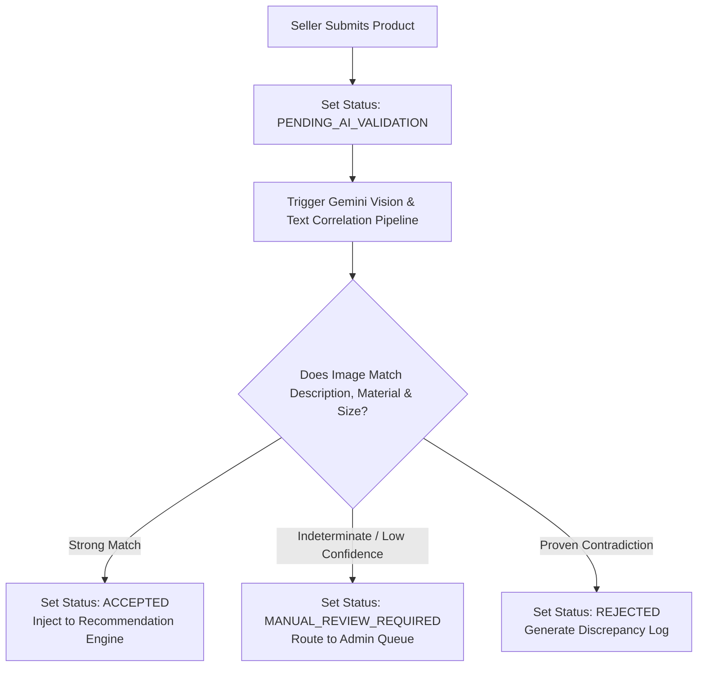

# 🏬 SmartSpace AI - Seller Dashboard Functional Specification

This specification outlines the architecture, database adjustments, backend REST API contracts, and user experience workflows for the **Seller Dashboard** module within the SmartSpace AI ecosystem. Sellers on the platform manage their own inventory, handle fulfillment directly with customers (cash on delivery or direct payment collection), and track their commission obligations to the platform.

---

## 🗄️ 1. Database Model Architectural Adjustments

To accommodate independent sellers, the existing database architecture requires updates to the catalog data structures and the introduction of a dedicated transaction tracking engine.

### A. Extensions to the Product Schema

The core product collection must incorporate references and status tracks to differentiate seller-submitted items from standard scraped indexes.

* **Seller Ownership:** A mandatory reference field linking the product record to a unique identifier in the user collection, restricted to accounts holding the certified seller role.
* **Taxonomy & Data Constraints:** Enforced normalization for critical fields. Categories, colors, and materials are restricted to validated system taxonomies, preventing unstructured text entry.
* **AI Pipeline Auditing Fields:**
* *Processing Status:* An enumerated state tracking the submission through the evaluation pipeline (`PENDING_AI_VALIDATION`, `ACCEPTED`, `MANUAL_REVIEW_REQUIRED`, `REJECTED`).
* *AI Discrepancy Log:* A textual description capturing structural discrepancies flagged by the computer vision or text correlation steps (e.g., mismatch between a wood material label and an image showing metal properties).
* *Reviewer Note:* Optional remarks appended by an administrator if the item passes through manual review.

### B. The Buy Request (Order) Schema

A new transactional collection is required to govern interactions between buyers and sellers, tracking order status and platform fee tracking.

* **Identifiers:** Unique identification for each request, along with direct references to the purchasing user, the selling user, and the target product.
* **Transaction Metrics:** Quantities requested, individual unit price locked at the exact millisecond of purchase, and computed gross total price.
* **Fulfillment Pipeline State:** An enumerated workflow field representing the local tracking phase:
* `PENDING`: Customer submitted, awaiting seller acknowledgment.
* `PROCESSING`: Accepted by the seller, packaging or scheduling transit.
* `DELIVERED`: Delivered directly to the customer, and funds have been collected.
* `REJECTED`: Declined by the seller (e.g., out-of-stock, logistics failure).

* **Logistics Meta-Data:** Full buyer shipping details including recipient full name, primary contact phone number, destination country, city, district, and exact street address.
* **Platform Commission Accounting Flags:**
* *Applied Commission Percentage:* The exact percentage rate assigned to the seller at the moment the transaction hits completion.
* *Commission Amount Owed:* The calculated currency value ($Total \times Percentage$) designated for platform recovery.
* *Commission Settlement Status:* A Boolean tracking flag (`is_commission_paid`) that remains false upon delivery and shifts to true only when the platform administrator verifies receipt of monthly fees.
* *Settlement Group Identifier:* A string tracking index assigning the request to a specific billing cycle month and year (e.g., "2026-08") for accounting reconciliation.

---

## 📡 2. Backend REST API Endpoints Specification

All endpoints detailed below must sit behind strict route guards requiring valid Json Web Token verification and explicit authorization checks confirming the requesting account contains verified seller privileges.

### A. Inventory Control Endpoints

#### 📥 Create Seller Product

* **HTTP Method & Path:** `POST /api/seller/products`
* **Functional Description:** Registers a new custom item within the public platform index. The payload passes through rigorous Joi schema checks verifying that categories, colors, and materials exactly match allowed dropdown choices.
* **Pipeline Impact:** Upon creation, the backend forces the product's availability flags to false and routes the document straight into the AI asynchronous validation queue, returning a status indicating processing has commenced.

#### 📝 Update Seller Product

* **HTTP Method & Path:** `PATCH /api/seller/products/:id`
* **Functional Description:** Modifies non-structural information of an active product (e.g., toggling manual stock status or price corrections).
* **Pipeline Impact:** If critical structural data changes—such as updating images, rewriting descriptions, or altering dimensions—the backend resets the approval state and pushes the item back into the AI validation queue.

#### 🔍 Fetch Seller Catalog

* **HTTP Method & Path:** `GET /api/seller/products`
* **Functional Description:** Returns a paginated catalog of all items owned by the authenticated seller. Supports query filters matching AI processing statuses, standard room categories, and stock availability metrics.

#### ❌ Remove Seller Product

* **HTTP Method & Path:** `DELETE /api/seller/products/:id`
* **Functional Description:** Permanently deletes or structurally archives a product listing owned by the seller, removing it from active AI recommendation logic loops.

### B. Order Fulfillment Endpoints

#### 📦 Fetch Associated Buy Requests

* **HTTP Method & Path:** `GET /api/seller/buy-requests`
* **Functional Description:** Obtains a structured feed of all incoming purchase requests mapped to the seller's profile. Supports filtration by the fulfillment state (`PENDING`, `PROCESSING`) and sorting by creation timestamp.

#### 🔄 Update Fulfillment State

* **HTTP Method & Path:** `PATCH /api/seller/buy-requests/:id/status`
* **Functional Description:** Alters the transactional state of an order.
* **Fulfillment Transition Guardrails:** Pushing a state change to `DELIVERED` forces the system to snapshot the seller's active platform commission metric, calculate the platform cut, and assign a month-year string tag to the document for long-term ledger integrity.

### C. Financial Auditing Endpoints

#### 💰 Fetch Statement of Earnings

* **HTTP Method & Path:** `GET /api/seller/earnings`
* **Functional Description:** Computes a comprehensive balance statement for the authenticated seller. The controller scans the order history to aggregate gross revenue from all items marked as delivered, isolates the segment where commission paid equals false to output outstanding platform debt, and calculates historical totals for paid commissions.

---

## ⚙️ 3. Detailed Feature Implementations & Workflows

### A. The Structural Dropdown Product Creation Workflow

To guarantee that user-generated product listings blend seamlessly into the AI recommendation engine without causing structural errors during budget allocation or semantic aliasing, sellers are strictly barred from entering free-form layout metadata.

1. **Taxonomy Enforcement:** During form initialization, the user interface calls system configuration caches to populate dropdown selectors. Sellers must exclusively select values from predefined categories, primary/secondary colors, and dominant material attributes.
2. **Multiphase Input Capture:** The creation interface splits data gathering into logical sections: Core marketing details, strict physical dimensions, pricing strategies, and image assets.
3. **Media Asset Association:** Image modules enforce the designation of a distinct primary display card alongside auxiliary angle shots, laying the groundwork for visual extraction analysis.

### B. Asynchronous AI Automated Validation Pipeline

Every seller submission passes through an automated evaluation workflow designed to detect inaccurate descriptions, catalog spam, or mismatches prior to public catalog ingestion.

1. **Ingestion Phase:** The product document enters the database with an operational flag of `PENDING_AI_VALIDATION`. It is temporarily excluded from search views and recommendation scoring tiers.
2. **Correlation Processing:** The system invokes a dedicated AI pipeline via the Google Gemini SDK. The AI model receives the primary image asset alongside text parameters outlining the description, dimensions, and materials.
3. **Cross-Examination Rules:** The AI evaluates whether the provided visual components align with the stated metadata (e.g., verifying that a chest of drawers described as "Solid Oak" does not clearly show clear plastic moldings, or checking that dimensions match human scale expectations).
4. **Automatic Ingestion Resolution:**
* *Confidence $\ge$ System Threshold:* The system updates the status to `ACCEPTED`, automatically computes embedded vector texts based on parameters, and moves the item into the live product pool.
* *Contradiction Confirmed:* The status updates to `REJECTED`, the system flags the issues within the tracking record, and logs an error summary viewable on the seller's panel.
* *Indeterminate Assessment:* If the evaluation framework encounters low confidence parameters or ambiguous correlations, it tags the record as `MANUAL_REVIEW_REQUIRED` and pushes the case to the admin validation queue without exposing it to the consumer market.

### C. Direct-to-Consumer Order Lifecycle & Commission Accounting

Because fulfillment occurs directly between the merchant and the consumer, the backend acts as a strict ledger to maintain order transparency and commission tracking.

1. **Order Generation:** When an individual finalized staging set triggers a purchase, separate records are split across relevant sellers based on inventory ownership. The seller's order shifts to `PENDING`.
2. **Processing Commitment:** The seller updates the request state to `PROCESSING`, signaling intent to coordinate shipment.
3. **Execution and Settlement Logging:** The seller handles delivery and collects funds directly from the customer. Once confirmed, the seller changes the status to `DELIVERED`.
4. **Commission Capture:** The moment the status changes to `DELIVERED`, the system automatically executes a transaction calculation block:
* It references the seller's specific profile to read their unique agreed-upon platform commission percentage.
* It calculates the absolute cut ($Owed = GrossTotal \times Percentage$).
* It updates the order document, setting `is_commission_paid` to `false` and stamping it with the current accounting month identifier.

5. **Reconciliation:** The statement balance updates immediately, raising the seller's outstanding platform debt indicator. This balance remains open until an administrator receives the aggregated monthly payment and marks the cycle closed.

---

## 🖥️ 4. User Experience & Interface Architecture

### A. Core Analytics Overview Component

* **Key Performance Cards:** Four prominent metric blocks anchored at the top layout. Total Revenue Generated (accumulated from all completed deliveries), Open Orders Pending, Active Product Count, and Owed Platform Fees.
* **Interactive Chronological Charting:** A clean line chart plotting earnings history aggregated daily over a rolling 30-day window, paired with a status breakdown chart illustrating pending logistics loads.

### B. Dynamic Inventory Status Grid

* **Presentation Structure:** A data table providing visibility into stock parameters. Each row item displays product thumbnails, categorization tags, localized pricing, stock toggles, and processing state labels.
* **Status Indicators:** Visual indicators make listing status instantly clear. A green badge indicates a live, verified status; amber highlights an item awaiting admin validation review; and red alerts the seller to an item rejected by the AI pipeline. Selecting a rejected item reveals the AI's discrepancy report.

### C. Financial Tracking Ledger

* **Debt Visualization Block:** A structural layout dedicated to financial clarity. It separates gross sales figures from platform commission allocations, giving merchants clear insight into what they owe the platform.
* **Historical Invoicing Logs:** A chronological record grouping operations by their accounting calendar month tags. Each row item displays the period target, total sales achieved, platform fees incurred, payment status, and verification stamps confirming receipt of platform balances.

---

